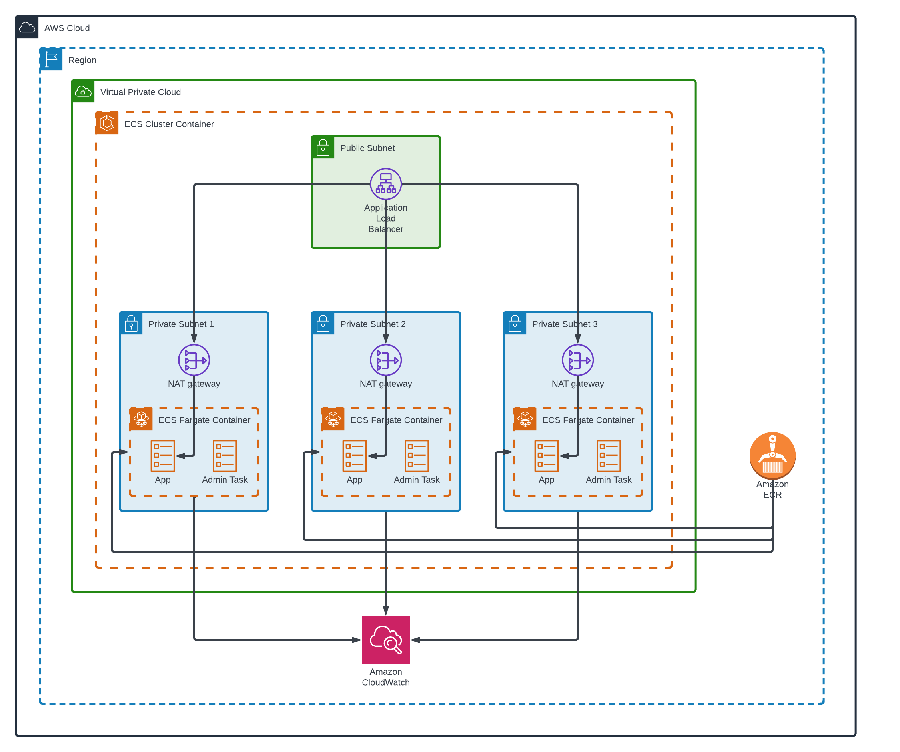

# Hello World API Service

## Application

This is a simple Hello World API service built with Flask, a Python web framework. It provides three API endpoints and logs each request in a structured JSON format.

### How to Build Docker Image

1. Clone this repository: `git clone https://github.com/lumaragu/terraform-docker.git`
2. Navigate to the project directory: `cd terraform-docker/app`
3. Build the Docker image: `docker build -t hello-world-api .`

### How to Run Locally

1. Run the Docker container: `docker run -p 8080:80 hello-world-api`

### API Endpoints

- GET `/hello_world`: Returns a 200 status code with `{ "message": "Hello World!" }` JSON response.
- GET `/current_time?name=some_name`: Returns a 200 status code with `{ "timestamp": 1700000000, "message": "Hello some_name" }`.
- GET `/healthcheck`: Returns a 200 status code to indicate that the service is healthy.

### How to Tag and Push to Amazon ECR

1. Tag the Docker image: `docker tag hello-world-api:latest ecr-repository/hello-world-api:latest`
2. Push the image to Amazon ECR: `docker push ecr-repository/hello-world-api:latest`

## Infrastructure

This is a simplified diagram with the proposed infrastructure to deploy the service using AWS.

